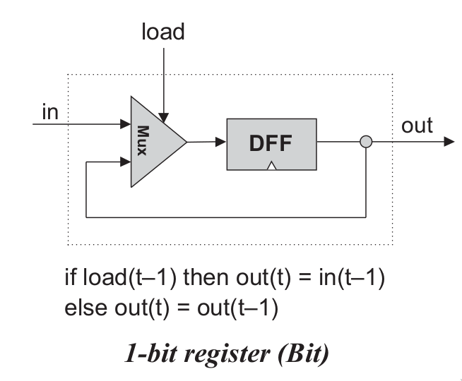
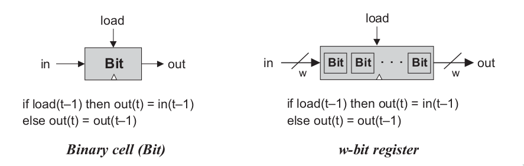
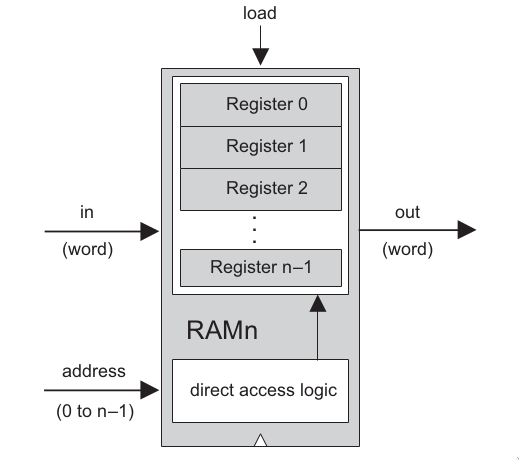
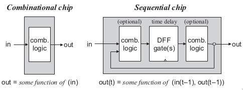

# Sequential logic

Boolean chip với arithmetic chip là những combinational chips.

Combinational chips compute functions that depend solely on combinations of their input values (Về cơ bản, đống chip này hoạt động dựa trên sự kết hợp giữa các input) -> Để xây dựng những chức năng xử lý quan trọng như là ALU. 

Nhưng chúng không thể duy trì state (store and recall values). Vậy nên, cần có memory để lưu trữ dữ liệu theo thời gian. These memory elements are built from sequential chips.

## Mở đầu

Liên quan đến thời gian, Clock (Cycle) với Flip flop (Là một con chip primitive để thể hiện việc execute sau một cycle hoặc một khoảng thời gian nhất định)

### Cái đồng hồ

In most computers, the passage of time is represented by a master clock that delivers a continuous train of alternating signals (alternates continuously between two phases labeled 0–1, low-high, tick-tock, etc)

The elapsed time between the beginning of a ‘‘tick’’ and the end of the subsequent ‘‘tock’’ is called **cycle**.

The current clock phase (tick or tock) is *represented by a binary signal*.

### Flip-flop

Trong Nand2Tetris thì sẽ sử dụng: data flip-flop (DFF)

$out(t) = in(t - 1)$

`in` and `out` are the gate’s input and output values and t is the current clock cycle => DFF outputs the input value from the previous time unit

### Registers

A register is a storage device that can ‘‘store,’’ or ‘‘remember,’’ a value over time.

A single-bit register, which we call Bit, or binary cell, is designed to store a single bit of information (0 or 1).

Không hiểu lắm việc gọi nó là classical storage behavior: $out(t) = out(t - 1)$

> the ‘‘select bit’’ of this multiplexor can become the ‘‘load bit’’ of the overall register chip: If we want the register to start storing a new value, we can put this value in the in input and set the load bit to 1; if we want the register to keep storing its internal value until further notice, we can set the load bit to 0.

Rồi chuyển qua register (Lưu trữ dữ liệu cho một số lượng bit nhất định, không biết có phải là nó chứa mỗi một register là một word không?)

The basic design parameter of such a register is its **width** — the number of bits that it holds — e.g., 16, 32, or 64. 

The multi-bit contents of such registers are typically referred to as **words**.

### Memories

A direct-access memory unit, also called RAM, is an array of n w-bit registers, equipped with direct access circuitry. The number of registers (n) and the width of each register (w) are called the memory’s **size** and **width**, respectively

Stacking together many registers to form a Random Access Memory (RAM) unit. Implement cái RAM (Về cơ bản là một Stack chứa nhiều Registers) với một cơ chế đặc biệt khác để tra cứu dữ liệu dựa trên địa chỉ

> a classical RAM device accepts three inputs: a data input, an address in-put, and a load bit. 
> The address specifies which RAM register should be accessed in the current time unit. In the case of a read operation (load=0), the RAM’s outputimmediately emits the value of the selected register. 
> In the case of a write operation (load=1), the selected memory register commits to the input value in the next time unit, at which point the RAM’s output will start emitting it.

The basic design parameters of a RAM device are:

- Data width - the width of each one of its words (size của mỗi từ)
- Size — the number of words in the RAM. 

Modern computers typically employ 32- or 64-bit-wide RAMs whose sizes are up to hundreds of millions.

**Tự hỏi**: Mình khá phân vân giữa words, bits, và registers:

- Một word là đại diện cho data width của RAM, tức là một số lượng bit nhất định.
- Một register thì cũng tương tự: **width** — the number of bits that it holds
- Một bit là gì?

### Counter 

A counter is a sequential chip whose state is an integer number that increments every time unit, effecting the function:

$out(t) = out(t - 1) + c$ ($c$ thường bằng 1)

**Fact**: A typical CPU includes a **program counter** whose output is interpreted as the address of the instruction that should be executed next in the current program (Xác định địa chỉ của instruction tiếp theo cần thực hiện trong chương trình hiện tại).

??? Cái +1 với Reset cho một Register?

### Time Matters

Fact: A **data race** occurs when 2 instructions from different threads access the same memory location, at least one of these accesses is a write and there is no synchronization that is mandating any particular order among these accesses.

(Đến đoạn này thấy khó hiểu rồi)

Kiểu nói về Feedback Loop (Cái hình trên) với gi đó....

## Cụ thể

### DFF (data flip flop)